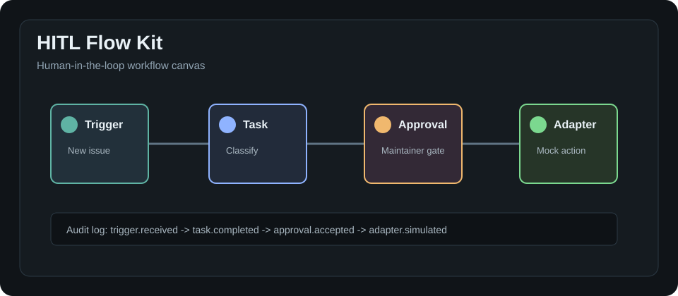

# HITL Flow Kit

Open-source workflow canvas and runner for human-in-the-loop AI agent operations.




AI agents do not only fail because the model is weak. They fail because the workflow around the model is missing: approval gates, audit logs, retry rules, handoffs, and clear ownership.

HITL Flow Kit turns those operating patterns into reusable workflow definitions that can be reviewed, tested, and maintained like code.

## Maintainer Promise

Use AI to prepare work, not to hide decisions.

Every workflow in this repository is designed to make four things explicit:

- the action an agent wants to take
- the human role that must approve it
- the adapter boundary where an external system would be touched
- the audit event that explains what happened

## Why This Exists

Most agent projects start as scripts, prompts, and scattered runbooks. That works for a demo, but it gets fragile when a real team needs to understand who approved an action, what retried, what was skipped, and where a human should take over.

This project focuses on the operational layer:

- What should the agent do next?
- When should a human approve the action?
- What gets written to the audit log?
- What happens when an adapter fails?
- Who owns the handoff when automation stops?

## What It Does

- Design workflows as explicit steps and dependencies
- Pause for human approval before sensitive actions
- Simulate adapter calls without connecting real services
- Record audit events for every step
- Validate workflow examples before publishing them
- Keep private data out of examples by default

## 30-second Quickstart

```bash
npm install
npm test
npm run validate
npm run scan:public
npm run run:issue
```

`npm install` is optional for `v0.1.0` because the project has no runtime dependencies. The command is included so the flow feels familiar in fresh clones.

Run any example directly:

```bash
npm run run:issue
npm run run:content
npm run run:appointment
npm run run:release
```

## Example Workflows

| Workflow | What it shows | Why it matters |
| --- | --- | --- |
| `examples/issue-triage-workflow` | Classify an issue, ask for maintainer approval, apply labels through a mock adapter, and write an audit event. | Maintainers can keep repository actions reviewable. |
| `examples/content-review-workflow` | Check a draft against a style guide, pause for editor approval, and record the suggested result. | Teams can use agent review without losing editorial ownership. |
| `examples/appointment-workflow` | Coordinate a meeting request with deduplication, approval, scheduling, reminder, and outcome logging. | Operations teams can model human handoffs before automation touches real systems. |
| `examples/release-checklist-workflow` | Verify a release, pause for maintainer approval, draft release notes through a mock adapter, and record the audit trail. | OSS projects can make release automation reviewable before publishing anything. |

See `docs/oss-maintainer-workflows.md` for the maintainer-oriented workflow map.

## Who It Is For

- OSS maintainers who want safer issue triage workflows
- Small teams adopting AI agents in operational processes
- Developers building agent tools that need approval and audit primitives
- Product teams turning manual runbooks into explicit workflow definitions

## What Ships in v0.1.0

- Local workflow runner
- Workflow validation
- Cycle and missing-dependency detection
- Public-safe example workflows
- Mock adapter contract
- Static canvas preview
- Public secret-pattern scan
- GitHub issue and PR templates
- Four public-safe workflow examples

## Workflow Shape

Workflows are JSON documents with a stable schema:

```json
{
  "id": "issue-triage",
  "version": "0.1.0",
  "name": "Issue Triage",
  "steps": [
    {
      "id": "classify",
      "type": "task",
      "name": "Classify issue"
    },
    {
      "id": "maintainer-approval",
      "type": "approval",
      "dependsOn": ["classify"],
      "approval": {
        "role": "maintainer",
        "prompt": "Review the proposed labels and reply."
      }
    }
  ]
}
```

See `schemas/workflow.schema.json` and the `examples/` directory for complete workflows.

## Local Runner

The current runner is intentionally small. It validates dependencies, detects cycles, simulates each step, and returns an audit log. It does not call external APIs.

```bash
npm run run:issue
npm run run:content
npm run run:appointment
npm run run:release
```

Example output:

```json
{
  "workflowId": "issue-triage",
  "status": "completed",
  "stepsRun": 5,
  "auditLog": [
    {
      "stepId": "maintainer-approval",
      "stepType": "approval",
      "status": "approved"
    }
  ]
}
```

## Canvas Preview

Open `canvas/index.html` in a browser to see a static workflow canvas preview. The preview uses local data only.

## Out of Scope for v0.1.0

- Real API adapters
- Hosted SaaS
- Background jobs
- Cron-based automation
- Production credentials
- Customer data imports
- Default network calls

## Safety Model

This repository is built for public examples:

- No real API keys
- No real customer data
- No production URLs
- No default external network calls
- No cron or background jobs

Read `docs/redaction-policy.md` before adding new examples.

## Roadmap

- GitHub Issues adapter prototype
- Visual workflow preview generated from JSON
- Workflow validation test fixtures
- Adapter interface examples
- CLI command for generating starter workflows
- Exportable audit log format
- Pull-request review workflow example
- Human approval inbox prototype

## Maintainer Launch Pack

If you are preparing a public launch, use:

- `CHANGELOG.md` for the `v0.1.0` release note
- `docs/github-publishing.md` for repository description, topics, and release checklist
- `docs/issue-drafts.md` for good-first-issue and help-wanted drafts
- `docs/launch-posts.md` for launch post drafts
- `docs/oss-maintainer-workflows.md` for maintainer use cases and adapter rules

## Contributing

Contributions are welcome. Good first issues should be small, local, and safe to run without credentials. See `CONTRIBUTING.md`.

Good first contribution ideas:

- Add a release checklist workflow example
- Improve the static canvas preview
- Add more validation error tests
- Document a mock adapter pattern
- Add a sample audit log fixture

## Security

Do not open an issue with secrets, tokens, private URLs, customer data, or production logs. See `SECURITY.md`.

## Project Status

HITL Flow Kit is early and intentionally small. The goal of `v0.1.x` is to make the core workflow shape useful, reviewable, and safe before adding real adapters.
