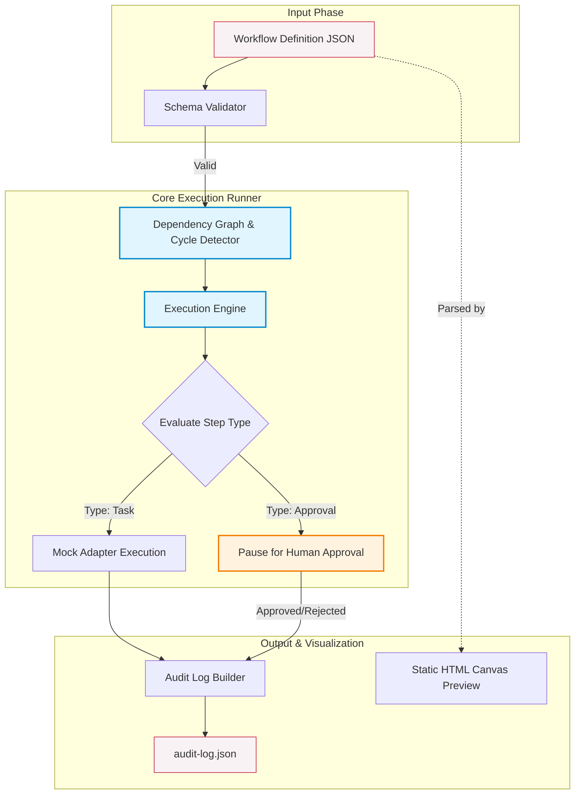

# Architecture

HITL Flow Kit has three small parts in `v0.1.0`.

## System Control Flow

This diagram maps how a workflow definition moves through the validation phase, is processed by the local runner (handling automated tasks and human approvals), and outputs an audit log.

## 1. Workflow Schema

Workflows describe operations as ordered steps with explicit dependencies.

Step types:

- `task`: local reasoning or transformation
- `approval`: pause for human review
- `adapter_call`: call a replaceable service adapter
- `wait`: represent a timed or external wait
- `notify`: record or send a notification

## 2. Local Runner

The runner:

1. Loads a workflow JSON file
2. Validates required fields
3. Checks dependency references
4. Detects cycles
5. Produces an execution order
6. Simulates each step
7. Returns an audit log

The runner does not call external services in `v0.1.0`.

## 3. Canvas Preview

The static canvas preview shows how a workflow can be represented visually. It is intentionally local and dependency-free.

## Adapter Boundary

Adapters should be thin wrappers around external systems. A workflow should remain understandable without knowing the adapter implementation.

The mock adapter is the only adapter included in `v0.1.0`.